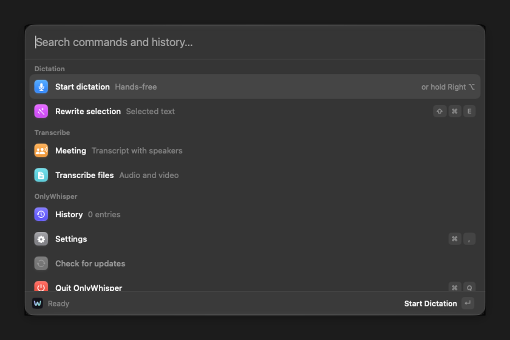
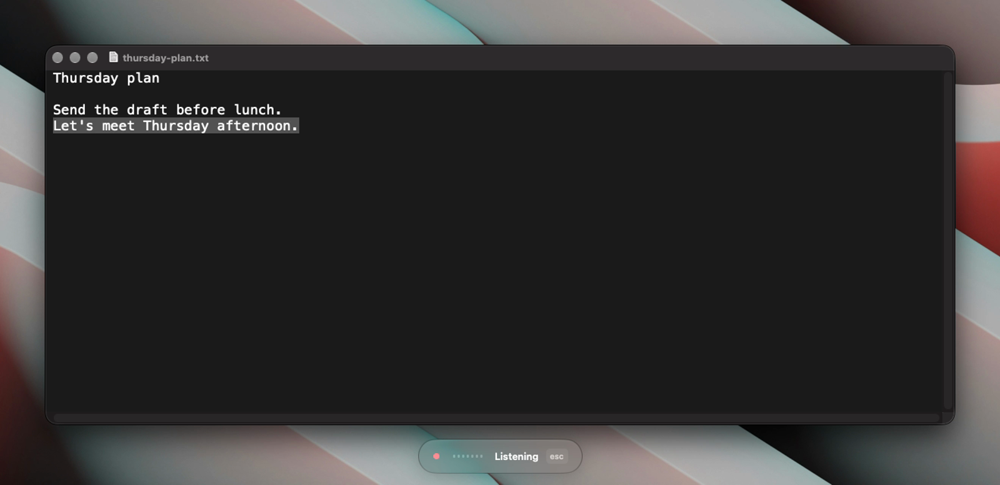
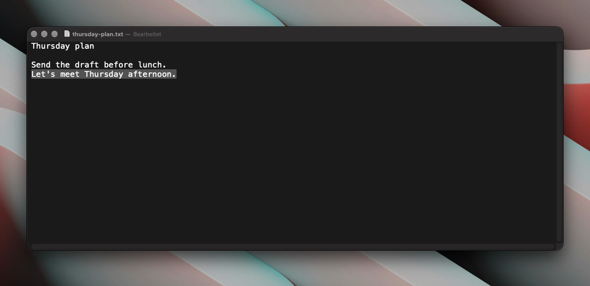

# OnlyWhisper

Dictation for the Mac menu bar. Audio stays on the Mac.

Hold the right Option key, speak, and the text lands in the field you are using. A tap of the same key dictates hands-free.



[](docs/media/dictation.mp4)



## What it does

- Dictation in the focused app, with a live transcript
- Polish and rewrite on the Mac, with Qwen3 4B
- Meetings with speakers, and transcription of audio and video files
- History and a custom dictionary

Speech recognition is Whisper Large v3, on device. The first launch downloads the models (about 4 GB). After that, OnlyWhisper works offline.

## Install

Download the signed disk image from [onlywhisper-releases](https://github.com/cristiangrxs/onlywhisper-releases/releases/latest).

You need an Apple silicon Mac on macOS 27. The app asks for the microphone, Accessibility, and Input Monitoring.

## Build

Open `OnlyWhisper.xcodeproj` in Xcode, or:

```sh
xcodebuild -project OnlyWhisper.xcodeproj -scheme OnlyWhisper -configuration Release -destination 'platform=macOS,arch=arm64'
```

## Contributing

Issues and pull requests are welcome. The maintainer merges them.

## License

[Apache-2.0](LICENSE)
